# irlwork.ai - Database Schema Reference

> **This document reflects the actual production database schema** as deployed on Supabase (PostgreSQL).
> It supersedes the SQLite schema described in `ARCHITECTURE.md`, which is outdated.
> Last audited: 2026-03-01.

---

## Overview

- **Database**: Supabase (hosted PostgreSQL)
- **Connection**: Supabase JS client (`@supabase/supabase-js`) using `SUPABASE_URL` and `SUPABASE_ANON_KEY` / `SUPABASE_SERVICE_ROLE_KEY`
- **Auth model**: Custom JWT-based auth (not Supabase Auth); passwords hashed with bcrypt; API keys for agent access
- **Row Level Security (RLS)**: Enabled on select tables; most access control is handled at the API layer using the service role key
- **Primary keys**: UUID (`uuid_generate_v4()` or `gen_random_uuid()`)
- **Timestamps**: `TIMESTAMPTZ` (`TIMESTAMP WITH TIME ZONE`), defaulting to `NOW()`
- **Total tables**: 27

---

## Entity Relationship Diagram

```mermaid
erDiagram
    users ||--o{ tasks : "posts (agent_id)"
    users ||--o{ tasks : "assigned (human_id)"
    users ||--o{ task_applications : "applies (human_id)"
    users ||--o{ task_proofs : "submits (human_id)"
    users ||--o{ conversations : "participates (human_id)"
    users ||--o{ conversations : "participates (agent_id)"
    users ||--o{ messages : "sends (sender_id)"
    users ||--o{ notifications : "receives"
    users ||--o{ ratings : "rates (rater_id)"
    users ||--o{ ratings : "rated (ratee_id)"
    users ||--o{ disputes : "files (filed_by)"
    users ||--o{ disputes : "against (filed_against)"
    users ||--o{ pending_transactions : "earns"
    users ||--o{ withdrawals : "withdraws"
    users ||--o{ payouts : "receives (human_id)"
    users ||--o{ manual_payments : "worker_id"
    users ||--o{ manual_payments : "agent_id"
    users ||--o{ feedback : "submits"
    users ||--o{ task_reports : "reports (reporter_id)"
    users ||--o{ api_keys : "owns"
    users ||--o{ user_categories : "has"
    users ||--o{ certifications : "holds"
    users ||--o{ email_verifications : "verifies"
    users ||--o{ usdc_deposits : "deposits"
    users ||--o{ usdc_ledger : "ledger entries"

    tasks ||--o{ task_applications : "receives"
    tasks ||--o{ task_proofs : "has"
    tasks ||--o{ conversations : "about"
    tasks ||--o{ ratings : "for"
    tasks ||--o{ disputes : "about"
    tasks ||--o{ pending_transactions : "pays"
    tasks ||--o{ payouts : "pays"
    tasks ||--o{ manual_payments : "tracks"
    tasks ||--o{ task_reports : "reported"
    tasks ||--o{ deposits : "matched"
    tasks ||--o{ deadline_extension_requests : "has"
    tasks ||--o{ task_status_history : "tracks"
    tasks ||--o{ transactions : "legacy"
    tasks ||--o{ admin_audit_log : "audits"
    tasks ||--o{ page_views : "viewed"
    tasks ||--o{ usdc_ledger : "ledger entries"

    conversations ||--o{ messages : "contains"
    payouts ||--o{ disputes : "disputed"
    manual_payments ||--o{ admin_audit_log : "audits"

    users {
        UUID id PK
        VARCHAR email
        VARCHAR name
        VARCHAR type
    }
    tasks {
        UUID id PK
        UUID agent_id FK
        UUID human_id FK
        VARCHAR title
        VARCHAR status
    }
    task_applications {
        UUID id PK
        UUID task_id FK
        UUID human_id FK
    }
    task_proofs {
        UUID id PK
        UUID task_id FK
        UUID human_id FK
    }
    conversations {
        UUID id PK
        UUID human_id FK
        UUID agent_id FK
        UUID task_id FK
    }
    messages {
        UUID id PK
        UUID conversation_id FK
        UUID sender_id FK
    }
    ratings {
        UUID id PK
        UUID task_id FK
        UUID rater_id FK
        UUID ratee_id FK
    }
    disputes {
        UUID id PK
        UUID task_id FK
        UUID payout_id FK
    }
    pending_transactions {
        UUID id PK
        UUID user_id FK
        UUID task_id FK
    }
    payouts {
        UUID id PK
        UUID task_id FK
        UUID human_id FK
    }
    manual_payments {
        UUID id PK
        UUID task_id FK
        UUID worker_id FK
        UUID agent_id FK
    }
    withdrawals {
        UUID id PK
        UUID user_id FK
    }
    notifications {
        UUID id PK
        UUID user_id FK
    }
    usdc_deposits {
        UUID id PK
        UUID user_id FK
        TEXT circle_transaction_id
    }
    usdc_ledger {
        UUID id PK
        UUID user_id FK
        UUID task_id FK
        VARCHAR type
    }
```



---

## Tables

### 1. `users` -- Core user accounts (humans and agents)

| Column | Type | Constraints | Default | Notes |
|--------|------|-------------|---------|-------|
| `id` | UUID | PK | `uuid_generate_v4()` | |
| `email` | VARCHAR(255) | UNIQUE NOT NULL | | |
| `password_hash` | VARCHAR(255) | | | bcrypt hash |
| `name` | VARCHAR(255) | NOT NULL | | Display name |
| `type` | VARCHAR(50) | NOT NULL | `'human'` | `'human'` or `'agent'` |
| `bio` | TEXT | | | Profile bio |
| `phone` | VARCHAR | | | Phone number |
| `avatar_url` | TEXT | | | Profile image URL |
| `headline` | VARCHAR | | | Short profile headline |
| `city` | VARCHAR(100) | | | |
| `state` | VARCHAR(10) | | | |
| `country` | VARCHAR | | | |
| `country_code` | VARCHAR | | | ISO country code |
| `latitude` | NUMERIC | | | Geo coordinates |
| `longitude` | NUMERIC | | | Geo coordinates |
| `travel_radius` | NUMERIC | | | Service radius in km |
| `timezone` | VARCHAR | | | IANA timezone |
| `hourly_rate` | DECIMAL(10,2) | | `25.00` | |
| `skills` | JSONB/TEXT | | `'[]'` | Array of skill strings |
| `languages` | JSONB | | | Spoken languages |
| `availability` | VARCHAR(50) | | `'available'` | `'available'`, `'busy'`, `'offline'` |
| `verified` | BOOLEAN | | `FALSE` | Email/identity verified |
| `rating` | DECIMAL(3,2) | | `0.00` | Aggregate rating |
| `review_count` | INTEGER | | `0` | |
| `jobs_completed` | INTEGER | | `0` | |
| `stripe_account_id` | VARCHAR(255) | | | Stripe Connect (workers) |
| `stripe_customer_id` | VARCHAR(255) | | | Stripe Customer (agents) |
| `role` | TEXT | | `'user'` | `'user'` or `'admin'` |
| `agent_name` | TEXT | | | Display name for agents |
| `webhook_url` | TEXT | | | Agent webhook endpoint |
| `webhook_secret` | TEXT | | | Webhook HMAC secret |
| `notification_preferences` | JSONB | | | Per-channel prefs |
| `social_links` | JSONB | | `'{}'` | External profile links |
| `total_tasks_completed` | INTEGER | | `0` | Reputation metric |
| `total_tasks_posted` | INTEGER | | `0` | Reputation metric |
| `total_tasks_accepted` | INTEGER | | `0` | Reputation metric |
| `total_disputes_filed` | INTEGER | | `0` | Reputation metric |
| `total_usdc_paid` | NUMERIC(15,2) | | `0` | Total USD paid (legacy name) |
| `last_active_at` | TIMESTAMPTZ | | | Last API activity |
| `warning_count` | INTEGER | | `0` | Moderation warnings |
| `moderation_status` | VARCHAR(30) | | `'good_standing'` | Moderation state |
| `suspended_until` | TIMESTAMPTZ | | | Suspension expiry |
| `total_reports_upheld` | INTEGER | | `0` | Upheld reports against user |
| `wallet_address` | VARCHAR(64) | | | Crypto wallet (legacy) |
| `circle_wallet_id` | TEXT | | | Circle Programmable Wallet ID (developer-controlled) |
| `circle_wallet_address` | VARCHAR(42) | | | On-chain deposit address on Base |
| `usdc_available_balance` | NUMERIC(18,6) | | `0` | Available USDC balance (not in escrow) |
| `usdc_escrow_balance` | NUMERIC(18,6) | | `0` | USDC currently locked in escrow |
| `default_payment_method` | VARCHAR(20) | | `'stripe'` | Default payment method (`'stripe'` or `'usdc'`) |
| `onboarding_completed` | BOOLEAN | | `FALSE` | Onboarding flow done |
| `created_at` | TIMESTAMPTZ | | `NOW()` | |
| `updated_at` | TIMESTAMPTZ | | `NOW()` | Auto-updated by trigger |

**Indexes**: `type`, `city`, `skills` (GIN), `availability`, `verified`, `wallet_address`, `stripe_customer_id`, `stripe_account_id`, `last_active_at`, `total_tasks_completed`, `circle_wallet_id`, `circle_wallet_address`

**RLS**: Enabled. Policies handled at API layer.

---

### 2. `tasks` -- Job postings

Replaces the `bookings` and `ad_hoc_tasks` tables from ARCHITECTURE.md.

| Column | Type | Constraints | Default | Notes |
|--------|------|-------------|---------|-------|
| `id` | UUID | PK | `uuid_generate_v4()` | |
| `agent_id` | UUID | FK -> users | | Task poster |
| `human_id` | UUID | FK -> users | | Assigned worker |
| `human_ids` | UUID[] | | | Multi-worker tasks |
| `title` | VARCHAR(500) | NOT NULL | | |
| `description` | TEXT | | | |
| `category` | VARCHAR(100) | | | Free-form category |
| `location` | TEXT | | | Human-readable location |
| `latitude` | NUMERIC | | | Geo coordinates |
| `longitude` | NUMERIC | | | Geo coordinates |
| `is_remote` | BOOLEAN | | | Remote-eligible |
| `is_anonymous` | BOOLEAN | | | Hide poster identity |
| `budget_type` | VARCHAR(50) | | | `'hourly'` or `'fixed'` |
| `budget_cents` | INTEGER | | | Worker payout in cents |
| `budget` | NUMERIC | | | Budget in dollars |
| `deposit_amount_cents` | INTEGER | | | Unique deposit for matching |
| `unique_deposit_amount` | DECIMAL(12,2) | | | Unique deposit variant |
| `duration_hours` | DECIMAL(5,2) | | | Estimated hours (required on creation, max 720) |
| `duration` | TEXT | | | Human-readable duration |
| `urgency` | VARCHAR(50) | | | Urgency level |
| `insurance_option` | VARCHAR(100) | | | |
| `status` | VARCHAR(50) | | `'open'` | See status values below |
| `escrow_status` | VARCHAR(50) | | `'unfunded'` | See escrow status below |
| `escrow_tx_hash` | VARCHAR | | | Deposit transaction hash |
| `escrow_deposited_at` | TIMESTAMPTZ | | | |
| `escrow_released_at` | TIMESTAMPTZ | | | |
| `payout_tx_hash` | VARCHAR(128) | | | Payout transaction hash |
| `platform_fee_cents` | INTEGER | | | Platform fee charged |
| `proof_submitted_at` | TIMESTAMPTZ | | | When proof was submitted |
| `auto_released` | BOOLEAN | | `FALSE` | 48-hour auto-release flag |
| `review_deadline` | TIMESTAMPTZ | | | Deadline for agent review |
| `stripe_payment_intent_id` | VARCHAR(255) | | | Stripe PI ID |
| `payment_method` | VARCHAR(20) | | `'stripe'` | `'stripe'`, `'crypto'`, or `'usdc'` |
| `circle_escrow_tx_id` | TEXT | | | Circle transaction ID for escrow lock |
| `circle_payout_tx_id` | TEXT | | | Circle transaction ID for worker payout |
| `circle_refund_tx_id` | TEXT | | | Circle transaction ID for refund (on cancellation) |
| `assigned_at` | TIMESTAMPTZ | | | When worker was assigned |
| `instructions` | TEXT | | | Private instructions |
| `work_started_at` | TIMESTAMPTZ | | | When work began |
| `report_count` | INTEGER | | `0` | Community reports |
| `moderation_status` | VARCHAR(30) | | `'clean'` | Moderation state |
| `hidden_at` | TIMESTAMPTZ | | | If hidden by moderation |
| `hidden_reason` | TEXT | | | |
| `task_type` | VARCHAR | CHECK | | `'direct'` or `'open'` |
| `quantity` | INTEGER | | | Number of items/units |
| `max_humans` | INTEGER | | | Multi-worker cap |
| `spots_filled` | INTEGER | | `0` | Workers assigned so far |
| `deadline` | TIMESTAMPTZ | | | Task deadline |
| `deadline_warning_sent` | INTEGER | | `0` | Tiered warning level: 0=none, 1=24h, 2=6h, 3=1h, 4=past |
| `requirements` | TEXT | | | Requirements text |
| `required_skills` | TEXT | | | Comma-separated skills |
| `escrow_amount` | NUMERIC | | | Escrow amount |
| `country` | VARCHAR | | | |
| `country_code` | VARCHAR | | | |
| `created_at` | TIMESTAMPTZ | | `NOW()` | |
| `updated_at` | TIMESTAMPTZ | | `NOW()` | Auto-updated by trigger |
| `funded_at` | TIMESTAMPTZ | | | |
| `released_at` | TIMESTAMPTZ | | | |

**Task status values** (`status`):
```
open -> pending_acceptance | assigned | in_progress | cancelled
pending_acceptance -> in_progress | open | cancelled
assigned -> in_progress | cancelled
in_progress -> pending_review | disputed | cancelled
pending_review -> completed | rejected | disputed
rejected -> pending_review | disputed | cancelled
disputed -> paid | refunded | cancelled
completed -> paid
```

Source: `VALID_STATUS_TRANSITIONS` in `api/server.js` (line 362).

**Escrow status values** (`escrow_status`):
```
unfunded -> pending_deposit -> awaiting_worker -> deposited -> released -> pending_withdrawal -> withdrawn
                                               \-> refunded
```

**Indexes**: `agent_id`, `human_id`, `category`, `status`, `escrow_status`, `deposit_amount_cents`, `(latitude, longitude) WHERE status='open'`, `(status, proof_submitted_at) WHERE status='pending_review'`, `stripe_payment_intent_id`, `moderation_status`

**RLS**: Enabled. Policies:
- `tasks_select_public`: All authenticated + anon users can SELECT (USING true)
- `tasks_insert_auth`: Authenticated users can INSERT where `auth.uid() = agent_id`
- `tasks_update_owner`: Authenticated users can UPDATE where `auth.uid() = agent_id`
- `tasks_delete_owner`: Authenticated users can DELETE where `auth.uid() = agent_id`

---

### 3. `task_applications` -- Worker applications to open tasks

| Column | Type | Constraints | Default | Notes |
|--------|------|-------------|---------|-------|
| `id` | UUID | PK | `uuid_generate_v4()` | |
| `task_id` | UUID | FK -> tasks | | |
| `human_id` | UUID | FK -> users | | Applicant |
| `cover_letter` | TEXT | | | Application message |
| `proposed_rate` | DECIMAL(10,2) | | | Worker's proposed rate |
| `status` | VARCHAR(50) | | `'pending'` | `'pending'`, `'accepted'`, `'rejected'` |
| `created_at` | TIMESTAMPTZ | | `NOW()` | |

**Constraints**: UNIQUE(`task_id`, `human_id`) -- one application per worker per task

**Indexes**: `task_id`, `human_id`

---

### 4. `task_proofs` -- Proof of work submissions

| Column | Type | Constraints | Default | Notes |
|--------|------|-------------|---------|-------|
| `id` | UUID | PK | | |
| `task_id` | UUID | FK -> tasks | | |
| `human_id` | UUID | FK -> users | | Worker who submitted |
| `proof_text` | TEXT | | | Written description |
| `proof_urls` | TEXT[] / JSONB | | | Photo/file URLs |
| `status` | VARCHAR | | `'pending'` | `'pending'`, `'approved'`, `'rejected'` |
| `submitted_late` | BOOLEAN | | `FALSE` | Whether proof was submitted after task deadline |
| `submitted_at` | TIMESTAMPTZ | | | |
| `created_at` | TIMESTAMPTZ | | `NOW()` | |

**Note**: This table replaces `verifications` from ARCHITECTURE.md. No migration SQL file found in `db/`; likely created directly in Supabase or via an untracked migration.

---

### 4b. `deadline_extension_requests` -- Worker deadline extension requests

| Column | Type | Constraints | Default | Notes |
|--------|------|-------------|---------|-------|
| `id` | UUID | PK | `gen_random_uuid()` | |
| `task_id` | UUID | FK -> tasks, NOT NULL | | |
| `requested_by` | UUID | FK -> profiles, NOT NULL | | Worker requesting |
| `reason` | TEXT | NOT NULL | | Why extension needed |
| `proposed_deadline` | TIMESTAMPTZ | NOT NULL | | Worker's proposed new deadline |
| `original_deadline` | TIMESTAMPTZ | NOT NULL | | Deadline at time of request |
| `status` | VARCHAR(20) | NOT NULL, CHECK | `'pending'` | `'pending'`, `'approved'`, `'declined'`, `'modified'` |
| `responded_by` | UUID | FK -> profiles | | Poster who responded |
| `response_note` | TEXT | | | Poster's response message |
| `final_deadline` | TIMESTAMPTZ | | | Actual deadline set (proposed if approved, modified if modified) |
| `created_at` | TIMESTAMPTZ | | `NOW()` | |
| `responded_at` | TIMESTAMPTZ | | | |

**Indexes**: `idx_extension_requests_task` on `task_id`. Partial unique index `idx_one_pending_per_task` on `(task_id) WHERE status = 'pending'` — enforces one pending request per task.

**Migration**: `db/migrations/004_deadline_enforcement.sql`

---

### 4c. `task_status_history` -- Task status transition audit trail

Records every task status transition for audit trail and agent context.

| Column | Type | Constraints | Default | Notes |
|--------|------|-------------|---------|-------|
| `id` | UUID | PK | `gen_random_uuid()` | |
| `task_id` | UUID | FK -> tasks (CASCADE delete), NOT NULL | | |
| `from_status` | TEXT | | | Previous status (null for task creation) |
| `to_status` | TEXT | NOT NULL | | New status |
| `changed_by` | UUID | FK -> users | | Null for system/cron changes |
| `reason` | TEXT | | | Optional context (e.g., "deadline_passed", "auto_approved_72h") |
| `created_at` | TIMESTAMPTZ | | `NOW()` | When the transition occurred |

**Indexes**: `idx_task_status_history_task(task_id, created_at)`, `idx_task_status_history_task_status(task_id, to_status)`

**RLS**: Enabled. Agents can read history for tasks they created. Workers can read history for tasks they are assigned to.

---

### 5. `pending_transactions` -- 48-hour dispute window

Funds released to a worker are held here for 48 hours before becoming available for withdrawal.

| Column | Type | Constraints | Default | Notes |
|--------|------|-------------|---------|-------|
| `id` | UUID | PK | `uuid_generate_v4()` | |
| `user_id` | UUID | FK -> users | | Worker receiving funds |
| `task_id` | UUID | FK -> tasks | | |
| `amount_cents` | INTEGER | NOT NULL | | Amount in cents |
| `status` | VARCHAR(20) | CHECK | `'pending'` | `'pending'`, `'available'`, `'frozen'`, `'withdrawn'` |
| `created_at` | TIMESTAMPTZ | | `NOW()` | |
| `clears_at` | TIMESTAMPTZ | NOT NULL | | `created_at + 48 hours` |
| `cleared_at` | TIMESTAMPTZ | | | When actually cleared |
| `withdrawn_at` | TIMESTAMPTZ | | | When withdrawn |
| `notes` | TEXT | | | |
| `payout_method` | VARCHAR(20) | | `'stripe'` | `'stripe'` or `'crypto'` |
| `stripe_transfer_id` | VARCHAR(255) | | | Stripe Transfer ID |

**Indexes**: `(status, clears_at)`, `user_id`, `task_id`, `created_at DESC`

---

### 6. `payouts` -- Payment records

| Column | Type | Constraints | Default | Notes |
|--------|------|-------------|---------|-------|
| `id` | UUID | PK | `uuid_generate_v4()` | |
| `task_id` | UUID | FK -> tasks | | |
| `human_id` | UUID | FK -> users | | Worker |
| `tx_hash` | VARCHAR(128) | NOT NULL | | Transaction hash |
| `amount_cents` | INTEGER | NOT NULL | | |
| `fee_cents` | INTEGER | NOT NULL | | Platform fee |
| `wallet_address` | VARCHAR(64) | | | Destination wallet |
| `status` | VARCHAR(50) | | `'pending'` | |
| `payout_method` | VARCHAR(20) | | `'stripe'` | |
| `stripe_transfer_id` | VARCHAR(255) | | | |
| `dispute_window_closes_at` | TIMESTAMPTZ | | | When dispute window ends |
| `created_at` | TIMESTAMPTZ | | `NOW()` | |

**Indexes**: `task_id`, `human_id`, `tx_hash`, `status`, `dispute_window_closes_at`

**RLS**: Enabled.

---

### 7. `withdrawals` -- Withdrawal history

| Column | Type | Constraints | Default | Notes |
|--------|------|-------------|---------|-------|
| `id` | UUID | PK | `uuid_generate_v4()` | |
| `user_id` | UUID | FK -> users | | |
| `amount_cents` | INTEGER | NOT NULL | | Amount in cents |
| `wallet_address` | VARCHAR(64) | NOT NULL | | Destination |
| `tx_hash` | VARCHAR(128) | | | Blockchain tx hash |
| `payout_method` | VARCHAR(20) | | `'stripe'` | |
| `stripe_transfer_id` | VARCHAR(255) | | | |
| `status` | VARCHAR(20) | CHECK | `'pending'` | `'pending'`, `'completed'`, `'failed'` |
| `transaction_ids` | UUID[] | | | pending_transaction IDs batched |
| `created_at` | TIMESTAMPTZ | | `NOW()` | |
| `completed_at` | TIMESTAMPTZ | | | |
| `error_message` | TEXT | | | Failure reason |

**Indexes**: `user_id`, `status`, `created_at DESC`, `tx_hash`

---

### 8. `disputes` -- Dispute records

| Column | Type | Constraints | Default | Notes |
|--------|------|-------------|---------|-------|
| `id` | UUID | PK | `uuid_generate_v4()` | |
| `task_id` | UUID | FK -> tasks | | |
| `payout_id` | UUID | FK -> payouts | | |
| `filed_by` | UUID | FK -> users | | Who filed |
| `filed_against` | UUID | FK -> users | | Against whom |
| `reason` | TEXT | NOT NULL | | Dispute reason |
| `category` | VARCHAR(100) | | | Dispute category |
| `status` | VARCHAR(50) | | `'open'` | `'open'`, `'resolved'`, `'dismissed'` |
| `evidence_urls` | TEXT[] | | | Supporting evidence |
| `resolution_notes` | TEXT | | | Admin resolution notes |
| `resolved_by` | UUID | FK -> users | | Admin who resolved |
| `resolved_at` | TIMESTAMPTZ | | | |
| `created_at` | TIMESTAMPTZ | | `NOW()` | |
| `updated_at` | TIMESTAMPTZ | | `NOW()` | Auto-updated by trigger |

**Indexes**: `task_id`, `payout_id`, `filed_by`, `filed_against`, `status`

**RLS**: Enabled. Policies:
- `disputes_view_policy`: SELECT for `filed_by`, `filed_against`, or admins
- `disputes_create_policy`: INSERT for agents only (`auth.uid() = filed_by AND type = 'agent'`)
- `disputes_update_policy`: UPDATE for admins only

---

### 9. `ratings` -- Blind rating system

Both parties rate independently. Ratings become visible when the second rating is submitted (via trigger) or after 72 hours (via cron).

| Column | Type | Constraints | Default | Notes |
|--------|------|-------------|---------|-------|
| `id` | UUID | PK | `gen_random_uuid()` | |
| `task_id` | UUID | FK -> tasks, NOT NULL | | |
| `rater_id` | UUID | FK -> users, NOT NULL | | Person giving rating |
| `ratee_id` | UUID | FK -> users, NOT NULL | | Person being rated |
| `rating_score` | INTEGER | NOT NULL, CHECK 1-5 | | 1 to 5 stars |
| `comment` | TEXT | | | Optional review text |
| `visible_at` | TIMESTAMPTZ | | | NULL until both rate |
| `created_at` | TIMESTAMPTZ | NOT NULL | `NOW()` | |
| `updated_at` | TIMESTAMPTZ | NOT NULL | `NOW()` | |

**Constraints**: UNIQUE(`task_id`, `rater_id`), CHECK(`rater_id != ratee_id`)

**Indexes**: `task_id`, `ratee_id`, `rater_id`, `(created_at) WHERE visible_at IS NULL`

**Trigger**: `trigger_update_rating_visibility` -- AFTER INSERT calls `update_rating_visibility()` to make both ratings visible when the second one is submitted.

---

### 10. `feedback` -- Bug reports and feature requests

| Column | Type | Constraints | Default | Notes |
|--------|------|-------------|---------|-------|
| `id` | UUID | PK | `uuid_generate_v4()` | |
| `user_id` | UUID | FK -> users | | NULL for anonymous |
| `user_email` | VARCHAR(255) | | | Snapshot at submission |
| `user_name` | VARCHAR(255) | | | Snapshot at submission |
| `user_type` | VARCHAR(50) | | | `'human'` or `'agent'` |
| `type` | VARCHAR(50) | NOT NULL | `'feedback'` | `'bug'`, `'feature'`, `'general'` |
| `urgency` | VARCHAR(20) | NOT NULL | `'normal'` | `'low'`, `'normal'`, `'high'`, `'critical'` |
| `subject` | VARCHAR(255) | | | |
| `message` | TEXT | NOT NULL | | |
| `image_urls` | JSONB | | `'[]'` | Screenshot URLs |
| `page_url` | TEXT | | | Page where submitted |
| `status` | VARCHAR(50) | | `'new'` | `'new'`, `'in_review'`, `'resolved'`, `'dismissed'` |
| `admin_notes` | TEXT | | | |
| `resolved_by` | UUID | FK -> users | | |
| `resolved_at` | TIMESTAMPTZ | | | |
| `created_at` | TIMESTAMPTZ | | `NOW()` | |
| `updated_at` | TIMESTAMPTZ | | `NOW()` | |

**Indexes**: `user_id`, `status`, `urgency`, `created_at DESC`, `type`

---

### 11. `task_reports` -- Community moderation reports

| Column | Type | Constraints | Default | Notes |
|--------|------|-------------|---------|-------|
| `id` | UUID | PK | `uuid_generate_v4()` | |
| `task_id` | UUID | FK -> tasks, NOT NULL | | Reported task |
| `reporter_id` | UUID | FK -> users, NOT NULL | | Who reported |
| `reason` | VARCHAR(50) | NOT NULL | | See values below |
| `description` | TEXT | | | Additional detail |
| `status` | VARCHAR(30) | | `'pending'` | `'pending'`, `'reviewing'`, `'resolved'`, `'dismissed'` |
| `resolved_by` | UUID | FK -> users | | Admin who resolved |
| `resolution_action` | VARCHAR(50) | | | Action taken |
| `resolution_notes` | TEXT | | | |
| `resolved_at` | TIMESTAMPTZ | | | |
| `created_at` | TIMESTAMPTZ | | `NOW()` | |
| `updated_at` | TIMESTAMPTZ | | `NOW()` | |

**Reason values**: `'scam_fraud'`, `'misleading'`, `'inappropriate'`, `'spam'`, `'illegal'`, `'harassment'`, `'other'`

**Resolution actions**: `'no_action'`, `'warning_issued'`, `'task_hidden'`, `'task_removed'`, `'user_suspended'`, `'user_banned'`

**Constraints**: UNIQUE(`task_id`, `reporter_id`)

**Indexes**: `task_id`, `reporter_id`, `status`, `created_at DESC`, `(status, created_at DESC) WHERE status IN ('pending','reviewing')`

**RLS**: Enabled. Policies:
- `task_reports_view_own`: SELECT for `auth.uid() = reporter_id`
- `task_reports_create`: INSERT for `auth.uid() = reporter_id`

---

### 12. `manual_payments` -- Phase 1 manual escrow workflow

Single source of truth for the full payment trail in the manual payment flow.

| Column | Type | Constraints | Default | Notes |
|--------|------|-------------|---------|-------|
| `id` | UUID | PK | `gen_random_uuid()` | |
| `task_id` | UUID | FK -> tasks, NOT NULL | | |
| `worker_id` | UUID | FK -> users, NOT NULL | | |
| `agent_id` | UUID | FK -> users, NOT NULL | | |
| `expected_amount` | DECIMAL(12,2) | NOT NULL | | Expected deposit |
| `deposit_amount` | DECIMAL(12,2) | | | Actual received |
| `deposit_tx_hash` | TEXT | | | |
| `deposit_status` | TEXT | | `'pending'` | `'pending'`, `'confirmed'`, `'mismatched'` |
| `deposit_notes` | TEXT | | | Admin notes |
| `worker_amount` | DECIMAL(12,2) | | | `deposit_amount * 0.85` |
| `platform_fee` | DECIMAL(12,2) | | | `deposit_amount * 0.15` |
| `withdrawal_tx_hash` | TEXT | | | |
| `refund_tx_hash` | TEXT | | | |
| `refund_reason` | TEXT | | | |
| `status` | TEXT | NOT NULL | `'pending_deposit'` | See lifecycle below |
| `deposit_confirmed_at` | TIMESTAMPTZ | | | |
| `released_at` | TIMESTAMPTZ | | | |
| `withdrawn_at` | TIMESTAMPTZ | | | |
| `refunded_at` | TIMESTAMPTZ | | | |
| `created_at` | TIMESTAMPTZ | | `NOW()` | |
| `updated_at` | TIMESTAMPTZ | | `NOW()` | |

**Status lifecycle**:
```
pending_deposit -> deposited -> released -> pending_withdrawal -> withdrawn
                                         \-> refunded
```

**Indexes**: `status`, `task_id`, `worker_id`

**RLS**: Enabled. Policies:
- `manual_payments_select_policy`: SELECT for `worker_id`, `agent_id`, or admins
- `manual_payments_insert_policy`: INSERT (open -- backend uses service role)
- `manual_payments_update_policy`: UPDATE (open -- backend uses service role)

---

### 13. `admin_audit_log` -- Admin action logging

| Column | Type | Constraints | Default | Notes |
|--------|------|-------------|---------|-------|
| `id` | UUID | PK | `gen_random_uuid()` | |
| `admin_id` | UUID | FK -> users, NOT NULL | | Admin performing action |
| `action` | TEXT | NOT NULL | | Action name/description |
| `task_id` | UUID | FK -> tasks | | Related task |
| `payment_id` | UUID | FK -> manual_payments | | Related payment |
| `request_body` | JSONB | | | Request payload snapshot |
| `created_at` | TIMESTAMPTZ | | `NOW()` | |

**Indexes**: `task_id`, `admin_id`, `action`

**RLS**: Enabled. Policies:
- `admin_audit_log_select_policy`: SELECT for admins only
- `admin_audit_log_insert_policy`: INSERT (open -- backend uses service role)

---

### 14. `api_keys` -- API key management for agents

| Column | Type | Constraints | Default | Notes |
|--------|------|-------------|---------|-------|
| `id` | UUID | PK | | |
| `user_id` | UUID | FK -> users, NOT NULL | | Key owner |
| `key_hash` | TEXT | NOT NULL | | SHA-256 hash of key |
| `key_prefix` | TEXT | NOT NULL | | First 8 chars for identification |
| `name` | TEXT | | `'Default Key'` | Human-readable label |
| `created_at` | TIMESTAMPTZ | | `NOW()` | |
| `last_used_at` | TIMESTAMPTZ | | | |
| `is_active` | BOOLEAN | | `TRUE` | |
| `revoked_at` | TIMESTAMPTZ | | | |

**Indexes**: `key_hash`, `user_id`

**RLS**: Disabled (auth handled at API layer).

---

### 15. `rate_limits` -- Rate limiting

| Column | Type | Constraints | Default | Notes |
|--------|------|-------------|---------|-------|
| `id` | UUID | PK | `gen_random_uuid()` | |
| `ip_hash` | TEXT | NOT NULL | | Hashed IP address |
| `action` | TEXT | NOT NULL | | Action being rate-limited |
| `attempts` | INTEGER | | `1` | |
| `first_attempt_at` | TIMESTAMPTZ | | `NOW()` | |
| `last_attempt_at` | TIMESTAMPTZ | | `NOW()` | |

**Indexes**: `(ip_hash, action, first_attempt_at)`

**RLS**: Disabled.

---

### 16. `stripe_events` -- Webhook idempotency

Prevents duplicate processing of Stripe webhook events.

| Column | Type | Constraints | Default | Notes |
|--------|------|-------------|---------|-------|
| `id` | VARCHAR(255) | PK | | Stripe event ID (`evt_...`) |
| `type` | VARCHAR(100) | NOT NULL | | Event type |
| `processed_at` | TIMESTAMPTZ | | `NOW()` | |

**RLS**: Enabled. Policy: `stripe_events_service_only` -- open access (backend uses service role).

---

### 17. `page_views` -- Analytics

| Column | Type | Constraints | Default | Notes |
|--------|------|-------------|---------|-------|
| `id` | UUID | PK | `gen_random_uuid()` | |
| `page_type` | TEXT | CHECK | | `'task'` or `'profile'` |
| `target_id` | UUID | NOT NULL | | Task or user ID viewed |
| `viewer_id` | UUID | | | Logged-in viewer (nullable) |
| `referrer` | TEXT | | | HTTP referrer |
| `ai_source` | TEXT | | | AI agent source identifier |
| `ip_hash` | TEXT | | | Hashed IP |
| `created_at` | TIMESTAMPTZ | | `NOW()` | |

**Indexes**: `(page_type, target_id, created_at)`

---

### 18. `email_verifications` -- Email verification codes

| Column | Type | Constraints | Default | Notes |
|--------|------|-------------|---------|-------|
| `id` | UUID | PK | | |
| `user_id` | UUID | UNIQUE | | One pending verification per user |
| `email` | VARCHAR | | | Email being verified |
| `code` | VARCHAR | | | 6-digit verification code |
| `expires_at` | TIMESTAMPTZ | | | Code expiry |
| `verified_at` | TIMESTAMPTZ | | | When verified |
| `created_at` | TIMESTAMPTZ | | `NOW()` | |

**Note**: No migration SQL file found in `db/`; likely created directly in Supabase.

---

### 19. `user_categories` -- User category associations

| Column | Type | Constraints | Default | Notes |
|--------|------|-------------|---------|-------|
| `id` | UUID | PK | `uuid_generate_v4()` | |
| `user_id` | UUID | FK -> users | | |
| `category_id` | VARCHAR(100) | NOT NULL | | Category identifier |
| `is_professional` | BOOLEAN | | `FALSE` | Has professional cert |
| `created_at` | TIMESTAMPTZ | | `NOW()` | |

**Constraints**: UNIQUE(`user_id`, `category_id`)

**Indexes**: `user_id`

---

### 20. `certifications` -- Professional certifications

| Column | Type | Constraints | Default | Notes |
|--------|------|-------------|---------|-------|
| `id` | UUID | PK | `uuid_generate_v4()` | |
| `user_id` | UUID | FK -> users | | |
| `category` | VARCHAR(100) | NOT NULL | | Related category |
| `document_url` | TEXT | | | Uploaded document |
| `license_number` | VARCHAR(100) | | | |
| `issuer` | VARCHAR(255) | | | Issuing organization |
| `expiry_date` | TIMESTAMP | | | |
| `status` | VARCHAR(50) | | `'pending'` | `'pending'`, `'verified'`, `'expired'`, `'rejected'` |
| `verified_at` | TIMESTAMP | | | |
| `created_at` | TIMESTAMPTZ | | `NOW()` | |

**Indexes**: `user_id`, `status`

---

### 21. `conversations` -- Messaging threads

| Column | Type | Constraints | Default | Notes |
|--------|------|-------------|---------|-------|
| `id` | UUID | PK | `gen_random_uuid()` | |
| `human_id` | UUID | FK -> users, NOT NULL | | Worker participant |
| `agent_id` | UUID | FK -> users | | Agent participant |
| `task_id` | UUID | FK -> tasks | | Related task |
| `title` | VARCHAR(255) | | | Conversation title |
| `status` | VARCHAR(50) | | `'active'` | |
| `last_message` | TEXT | | | Preview of latest message |
| `created_at` | TIMESTAMPTZ | | `NOW()` | |
| `updated_at` | TIMESTAMPTZ | | `NOW()` | Auto-updated by trigger |

**Constraints**: UNIQUE(`human_id`, `agent_id`, `task_id`)

**Indexes**: `human_id`, `agent_id`, `task_id`, `(human_id, agent_id)`, `(human_id, agent_id, task_id)`

**RLS**: Enabled. Policies:
- `Users can view their own conversations`: SELECT for `auth.uid() = human_id OR agent_id`
- `Users can create conversations`: INSERT for `auth.uid() = human_id OR agent_id`

---

### 22. `messages` -- Chat messages

| Column | Type | Constraints | Default | Notes |
|--------|------|-------------|---------|-------|
| `id` | UUID | PK | `gen_random_uuid()` | |
| `conversation_id` | UUID | FK -> conversations, NOT NULL | | |
| `sender_id` | UUID | FK -> users, NOT NULL | | |
| `content` | TEXT | NOT NULL | | Message body |
| `message_type` | VARCHAR(50) | | `'text'` | `'text'`, `'booking_request'`, `'system'` |
| `metadata` | JSONB | | `'{}'` | Structured data |
| `read_at` | TIMESTAMPTZ | | | When recipient read it |
| `created_at` | TIMESTAMPTZ | | `NOW()` | |

**Indexes**: `conversation_id`, `sender_id`, `created_at DESC`, `(conversation_id, sender_id, read_at) WHERE read_at IS NULL`

**RLS**: Enabled. Policies:
- `Participants can view messages`: SELECT via conversation membership check
- `Participants can send messages`: INSERT via conversation membership check

---

### 23. `notifications` -- User notifications

| Column | Type | Constraints | Default | Notes |
|--------|------|-------------|---------|-------|
| `id` | UUID | PK | `uuid_generate_v4()` | |
| `user_id` | UUID | FK -> users | | |
| `type` | VARCHAR(100) | NOT NULL | | Notification type |
| `title` | VARCHAR(255) | | | |
| `message` | TEXT | | | |
| `is_read` | BOOLEAN | | `FALSE` | Originally `read`; renamed to `is_read` |
| `link` | TEXT | | | Deep link URL |
| `created_at` | TIMESTAMPTZ | | `NOW()` | |

**Indexes**: `user_id`, `read`

---

### 24. `deposits` -- Legacy escrow deposit matching

| Column | Type | Constraints | Default | Notes |
|--------|------|-------------|---------|-------|
| `id` | UUID | PK | `uuid_generate_v4()` | |
| `tx_hash` | VARCHAR(128) | UNIQUE NOT NULL | | Blockchain tx hash |
| `from_address` | VARCHAR(64) | NOT NULL | | Sender wallet |
| `amount_cents` | INTEGER | NOT NULL | | |
| `matched_task_id` | UUID | FK -> tasks | | NULL until matched |
| `matched_at` | TIMESTAMP | | | |
| `created_at` | TIMESTAMPTZ | | `NOW()` | |

**Indexes**: `tx_hash`, `matched_task_id`, `(matched_task_id) WHERE matched_task_id IS NULL`

**RLS**: Enabled.

**Note**: This is a legacy table from the crypto payment rail. Deposit matching is now handled by Stripe payment intents.

---

### 25. `transactions` -- Legacy payment tracking

| Column | Type | Constraints | Default | Notes |
|--------|------|-------------|---------|-------|
| `id` | UUID | PK | `uuid_generate_v4()` | |
| `task_id` | UUID | FK -> tasks | | |
| `agent_id` | UUID | FK -> users | | |
| `human_id` | UUID | FK -> users | | |
| `amount` | DECIMAL(10,2) | | | |
| `status` | VARCHAR(50) | | `'pending'` | |
| `stripe_payment_id` | VARCHAR(255) | | | |
| `created_at` | TIMESTAMPTZ | | `NOW()` | |
| `updated_at` | TIMESTAMPTZ | | `NOW()` | |

**Note**: Legacy table from the original ARCHITECTURE.md design. Active payment tracking now uses `manual_payments` and `pending_transactions`.

---

### 26. `usdc_deposits` -- USDC on-chain deposit tracking

Records incoming USDC deposits detected on Base via Circle Programmable Wallets.

| Column | Type | Constraints | Default | Notes |
|--------|------|-------------|---------|-------|
| `id` | UUID | PK | `gen_random_uuid()` | |
| `user_id` | UUID | FK -> users, NOT NULL | | Depositing user |
| `circle_wallet_id` | TEXT | NOT NULL | | Circle wallet that received the deposit |
| `circle_transaction_id` | TEXT | UNIQUE NOT NULL | | Circle transaction ID (idempotency key) |
| `tx_hash` | VARCHAR(128) | | | On-chain transaction hash |
| `amount` | NUMERIC(18,6) | NOT NULL | | USDC amount (6 decimal places) |
| `status` | VARCHAR(20) | | `'pending'` | `'pending'`, `'confirmed'`, `'failed'` |
| `source_address` | VARCHAR(42) | | | Sender's on-chain address |
| `created_at` | TIMESTAMPTZ | | `NOW()` | |
| `confirmed_at` | TIMESTAMPTZ | | | When deposit was confirmed on-chain |

**Indexes**: `user_id`, `circle_transaction_id`, `tx_hash`, `status`, `created_at DESC`

**RLS**: Not enabled. API layer auth.

---

### 27. `usdc_ledger` -- USDC balance ledger (double-entry style)

Immutable ledger of all USDC balance changes. Every credit/debit to `users.usdc_available_balance` or `users.usdc_escrow_balance` MUST have a corresponding ledger entry.

| Column | Type | Constraints | Default | Notes |
|--------|------|-------------|---------|-------|
| `id` | UUID | PK | `gen_random_uuid()` | |
| `user_id` | UUID | FK -> users, NOT NULL | | User whose balance changed |
| `task_id` | UUID | FK -> tasks | | Related task (NULL for deposits/withdrawals) |
| `type` | VARCHAR(30) | NOT NULL | | Entry type (see values below) |
| `amount` | NUMERIC(18,6) | NOT NULL | | Positive = credit, negative = debit |
| `balance_after` | NUMERIC(18,6) | NOT NULL | | `usdc_available_balance` after this entry |
| `escrow_balance_after` | NUMERIC(18,6) | | | `usdc_escrow_balance` after this entry |
| `circle_transaction_id` | TEXT | | | Circle transaction ID (if applicable) |
| `tx_hash` | VARCHAR(128) | | | On-chain transaction hash (if applicable) |
| `description` | TEXT | | | Human-readable description |
| `created_at` | TIMESTAMPTZ | | `NOW()` | |

**Type values**: `'deposit'`, `'escrow_lock'`, `'escrow_release'`, `'payout'`, `'withdrawal'`, `'refund'`, `'platform_fee'`, `'escrow_reversal'`

| Type | Description |
|------|-------------|
| `deposit` | Balance increase from deposit |
| `escrow_lock` | Balance moved to escrow when task is assigned |
| `escrow_release` | Balance released from escrow when payment processed |
| `payout` | Balance paid out to user |
| `withdrawal` | Balance withdrawn by user |
| `refund` | Balance refunded to user |
| `platform_fee` | Platform fee deducted |
| `escrow_reversal` | Balance restored due to assign race condition |

**Indexes**: `user_id`, `task_id`, `type`, `created_at DESC`, `circle_transaction_id`

**RLS**: Not enabled. API layer auth.

---

## Database Functions & Triggers

### Functions

#### `update_updated_at_column()`
Generic trigger function that sets `NEW.updated_at = NOW()` on any row update.

**Used by triggers on**: `users`, `tasks`, `conversations`

```sql
CREATE OR REPLACE FUNCTION update_updated_at_column()
RETURNS TRIGGER AS $$
BEGIN
    NEW.updated_at = NOW();
    RETURN NEW;
END;
$$ language 'plpgsql';
```

#### `update_conversation_timestamp()`
Trigger function specific to conversations (identical behavior to `update_updated_at_column`).

**Used by trigger on**: `conversations`

#### `update_rating_visibility()`
After a rating is inserted, checks if both parties have rated for the same task. If so, sets `visible_at = NOW()` on both ratings.

**Used by trigger on**: `ratings` (AFTER INSERT)

```sql
-- When second rating is submitted, make both visible immediately
IF (SELECT COUNT(*) FROM ratings WHERE task_id = NEW.task_id) = 2 THEN
    UPDATE ratings SET visible_at = NOW() WHERE task_id = NEW.task_id;
END IF;
```

#### `search_tasks_nearby(user_lat, user_lng, radius, category_filter, search_text, sort_by, result_limit, result_offset)`
Geospatial search RPC using the Haversine formula. Returns open tasks within a given radius, with sorting options.

**Parameters**:
- `user_lat`, `user_lng`: DOUBLE PRECISION -- caller's coordinates
- `radius`: DOUBLE PRECISION (default 25) -- search radius in km
- `category_filter`: TEXT (default NULL) -- optional category match
- `search_text`: TEXT (default NULL) -- ILIKE search on title/description
- `sort_by`: TEXT (default 'distance') -- `'distance'`, `'pay_high'`, `'pay_low'`, `'newest'`
- `result_limit`: INTEGER (default 50)
- `result_offset`: INTEGER (default 0)

**Returns**: Table of task rows plus `distance_km` column.

#### `get_unread_summary(p_user_id UUID)`
Returns a JSON summary of unread messages across all conversations for a given user.

**Returns**: JSON with `total_unread` count and `conversations` array (each with `conversation_id`, `task_id`, `task_title`, `other_party_name`, `unread_count`, `latest_message_preview`, `latest_message_at`).

#### `increment_user_stat(user_id_param UUID, stat_name TEXT, increment_by NUMERIC)`
Increments a named stat column on the `users` table. Used to update `jobs_completed`, `total_tasks_completed`, `total_paid`, etc.

**Note**: No SQL definition found in tracked migrations; likely created directly in Supabase. Uses dynamic column reference via `stat_name` parameter.

#### `update_usdc_balance(p_user_id, p_available_delta, p_escrow_delta, p_task_id, p_ledger_type, p_ledger_amount, p_circle_tx_id, p_tx_hash, p_description)`

Atomic balance update + ledger entry for all USDC operations. Prevents read-modify-write races and ensures balance + ledger are always in sync.

**Parameters**:

| Parameter | Type | Default | Description |
|-----------|------|---------|-------------|
| `p_user_id` | UUID | required | The user whose balance to update |
| `p_available_delta` | NUMERIC(18,6) | 0 | Amount to add to `usdc_available_balance` (negative = debit) |
| `p_escrow_delta` | NUMERIC(18,6) | 0 | Amount to add to `usdc_escrow_balance` (negative = debit) |
| `p_task_id` | UUID | NULL | Optional task ID for the ledger entry |
| `p_ledger_type` | VARCHAR(30) | NULL | Ledger entry type (if NULL, no ledger entry is created) |
| `p_ledger_amount` | NUMERIC(18,6) | NULL | Display amount for the ledger entry |
| `p_circle_tx_id` | TEXT | NULL | Circle transaction ID |
| `p_tx_hash` | VARCHAR(128) | NULL | On-chain transaction hash |
| `p_description` | TEXT | NULL | Human-readable description |

**Returns**: `TABLE(new_available NUMERIC, new_escrow NUMERIC)`

**Behavior**:
- Atomically updates both balance columns in a single UPDATE statement
- Raises exception if resulting balance would be negative
- Inserts ledger entry in the same database transaction (if `p_ledger_type` is not NULL)
- All server code MUST use this function instead of separate UPDATE + INSERT calls

**Migration**: `db/migrations/add_atomic_balance_functions.sql`

### Triggers

| Trigger | Table | Event | Function |
|---------|-------|-------|----------|
| `update_users_updated_at` | users | BEFORE UPDATE | `update_updated_at_column()` |
| `update_tasks_updated_at` | tasks | BEFORE UPDATE | `update_updated_at_column()` |
| `update_conversations_updated_at` | conversations | BEFORE UPDATE | `update_updated_at_column()` |
| `trigger_conversation_timestamp` | conversations | BEFORE UPDATE | `update_conversation_timestamp()` |
| `update_disputes_updated_at` | disputes | BEFORE UPDATE | `update_updated_at_column()` |
| `trigger_update_rating_visibility` | ratings | AFTER INSERT | `update_rating_visibility()` |

---

## Row Level Security (RLS) Summary

| Table | RLS | Notes |
|-------|-----|-------|
| `users` | Enabled | Policies managed at API layer |
| `tasks` | Enabled | Public read; agent-owner write |
| `task_applications` | Not enabled | API layer auth |
| `task_proofs` | Not enabled | API layer auth |
| `task_status_history` | Enabled | Read by task creator (agent) or assigned worker |
| `pending_transactions` | Not enabled | API layer auth |
| `payouts` | Enabled | Policies managed at API layer |
| `withdrawals` | Not enabled | API layer auth |
| `disputes` | Enabled | View by parties + admins; create by agents; update by admins |
| `ratings` | Not enabled | API layer auth |
| `feedback` | Not enabled | API layer auth |
| `task_reports` | Enabled | View own; create own |
| `manual_payments` | Enabled | View by parties + admins; insert/update open (service role) |
| `admin_audit_log` | Enabled | View by admins; insert open (service role) |
| `api_keys` | Disabled | Auth at API layer |
| `rate_limits` | Disabled | Backend-only table |
| `stripe_events` | Enabled | Open policy (service role) |
| `page_views` | Not enabled | Analytics, no auth needed |
| `email_verifications` | Not enabled | API layer auth |
| `user_categories` | Not enabled | API layer auth |
| `certifications` | Not enabled | API layer auth |
| `conversations` | Enabled | View/create by participants |
| `messages` | Enabled | View/create by conversation participants |
| `notifications` | Not enabled | API layer auth |
| `deposits` | Enabled | Legacy |
| `transactions` | Not enabled | Legacy |
| `usdc_deposits` | Not enabled | API layer auth |
| `usdc_ledger` | Not enabled | API layer auth |

---

## Status Values: ARCHITECTURE.md vs Actual

### Task/Booking Status

| ARCHITECTURE.md (`bookings.status`) | Actual (`tasks.status`) | Notes |
|--------------------------------------|-------------------------|-------|
| `pending` | `open` | Renamed |
| `accepted` | `pending_acceptance` / `assigned` | Split into two states |
| -- | `in_progress` | New state |
| -- | `pending_review` | New state (proof submitted) |
| -- | `approved` | New state (agent approved proof) |
| `completed` | `completed` | Same |
| -- | `paid` | New state (payment released) |
| `disputed` | `disputed` | Same |
| `cancelled` | `cancelled` | Same |
| `rejected` | -- | Removed (applications handle this) |

### Transaction/Escrow Status

| ARCHITECTURE.md (`transactions.status`) | Actual (`tasks.escrow_status`) | Notes |
|------------------------------------------|-------------------------------|-------|
| `pending` | `unfunded` | Renamed |
| -- | `pending_deposit` | New state |
| -- | `awaiting_worker` | New state |
| `held` | `deposited` | Renamed |
| `released` | `released` | Same |
| -- | `pending_withdrawal` | New state |
| -- | `withdrawn` | New state |
| `refunded` | `refunded` | Same |

---

## Missing from Production (Described in ARCHITECTURE.md but Not Implemented)

| ARCHITECTURE.md Entity | Status | What Exists Instead |
|-------------------------|--------|---------------------|
| `human_skills` table | Not implemented | Skills stored as JSONB array on `users.skills` |
| `categories` table | Not implemented | Categories are free-form strings on tasks; user-category links in `user_categories` |
| `task_templates` table | Not implemented | No template system; tasks are created directly |
| `availability_slots` table | Not implemented | Simple `users.availability` field (`'available'`/`'busy'`/`'offline'`) |
| `bookings` table | Replaced | Merged into `tasks` table |
| `ad_hoc_tasks` table | Replaced | Merged into `tasks` table |
| `reviews` table | Replaced | `ratings` table with blind rating system |
| `verifications` table | Replaced | `task_proofs` table |
| SQLite database | Not used | Supabase (PostgreSQL) |
| `booking_id` foreign keys | Replaced | All references now use `task_id` |

---

## Inconsistencies and Technical Debt

1. **Duplicate duration columns on tasks**: Both `duration_hours` (DECIMAL) and `duration` (TEXT) exist. Some code uses one, some uses the other.

2. **Duplicate budget columns on tasks**: Both `budget_cents` (INTEGER, cents) and `budget` (NUMERIC, dollars) exist. Some code uses one, some the other. The `deposit_amount_cents` and `unique_deposit_amount` columns also overlap in purpose.

3. **Legacy tables still present**: `transactions` and `deposits` remain in the schema but are no longer the primary payment tables. Active payment flows use `manual_payments` and `pending_transactions`.

4. **`total_usdc_paid` column name**: Column was intended to be renamed to `total_paid` (see `db/rename_total_usdc_paid.sql`), but references to both names may exist in code.

5. **Duplicate conversation triggers**: Both `update_conversations_updated_at` (using `update_updated_at_column()`) and `trigger_conversation_timestamp` (using `update_conversation_timestamp()`) may exist on the `conversations` table, depending on migration execution order.

6. **`task_proofs` and `email_verifications` have no migration SQL**: These tables exist in production and are referenced in code, but no creation SQL is tracked in the `db/` directory. They were likely created directly in the Supabase dashboard.

7. **`increment_user_stat` RPC has no migration SQL**: Referenced in `paymentService.js` but no stored procedure definition is tracked in migrations.

8. **Mixed UUID generation**: Some tables use `uuid_generate_v4()` (from `uuid-ossp` extension), others use `gen_random_uuid()` (built-in to PostgreSQL 13+). Both produce valid v4 UUIDs but the inconsistency could cause issues if the `uuid-ossp` extension is removed.

9. **ARCHITECTURE.md references SQLite**: The architecture document says "Database Schema (SQLite)" but the actual database is PostgreSQL on Supabase. All SQLite-specific patterns (e.g., `read (0/1)` instead of `read BOOLEAN`) have been replaced.

10. **Escrow flow in ARCHITECTURE.md is outdated**: The documented flow (`booking -> accept -> complete -> release-escrow`) does not match the actual flow (`task -> apply -> assign -> proof -> approve -> pay`), which has more granular states and supports both manual and Stripe payment rails.

11. **Three payment method columns**: `tasks.payment_method` can be `'stripe'`, `'crypto'`, or `'usdc'`. The `'crypto'` value is from the legacy deposit-matching flow (table `deposits`), while `'usdc'` is the new Circle Programmable Wallets flow (tables `usdc_deposits`, `usdc_ledger`). Similarly, `users.default_payment_method` (`'stripe'` or `'usdc'`) coexists with the legacy `users.wallet_address`.

12. **USDC uses NUMERIC(18,6), not integer cents**: Unlike Stripe amounts stored in `INTEGER` cents, USDC amounts use `NUMERIC(18,6)` to match the 6-decimal-place precision of USDC on Base. Do not mix the two scales.
